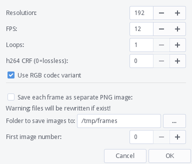

## Inkscape extension to convert SVG document layers to animation (*version 2*)

Tested on Inkscape 1.2 and 1.3.

### New in version 2

- Extension moved to the `Extensions` menu under `Export` submenu
- New dialog with video format selection
- New video formats: MP4 (H.264), WebM (VP9), ProRes, animated PNG (APNG), PNG, GIF
- Transparency can be enabled for formats supporting it (WebM, ProRes, (A)PNG, GIF)
- FPS and scale (former "resolution") input number types changed to floats
- Fixed linked images not being rendered bug


### Description

This extension creates frame-by-frame animation from an SVG document layers. 
Output formats are MP4, WebM, ProRes, GIF, APNG or just PNG image sequence.

To use the extension, install it (see instruction below), restart Inkscape and navigate
to `Extensions → Export → Export layers as animation frames...`


<!--  -->

Each layer in a document represents a single frame. Bottom layer is the first frame.
Layers can be nested to create scenes.

If a layer name is one of `bg`, `fg`, `background` or `foreground` then it 
will be visible throughout animation, and if the name is one of 
`hide`, `hidden`, `off` or `guides` then it will always be hidden. Another way
to change layer visibility is to add any of the keywords in square brackets to layer's
name, for example: `Layer 1 [bg]`, `Scene 2 [off]`.

Layers may be nested to organize, for example, separate scenes. Parent layers act like foreground. 
Only leaf layers will be treated as frames.

#### Parameters description

`Treat first level objects as frames` option tells the extension to make frames from
objects themselves and not from layers. This may be useful for quick animations. Only direct 
children of a layer can be frames. The first frame is an object with the lowest z-order.
Clones only supported if their original is labeled with one of the "always exposed" names (see above).
Object label can also be used to set background or hide the object in animation.

`Frame scale` parameter sets video dimensions in percents of a document size. 
For document size in absolute units: one inch equals to 96 pixels and 1 mm equals to 
`96/25.4 = ~3.78` pixels.

`Framerate` — animation speed in frames per second. FPS can be less than 1, this may be useful
for a simple slideshow.

`Loops` — how many times to repeat frames sequence. APNG and GIF formats ignore the parameter
and always loop infinitely.

`Back and forth` — append reversed frame sequence for a "ping-pong" animation. Only applicable
if frames count more than 2. Final frame count will be original frame count x2 minus 2.

`Set layer opacity to 100%` option is useful when you use a layer opacity for onion skinning, 
if the option is enabled then it will set opacity of each layer to 100% during export.

`Page transparency` option allows to create animations with transparency if supported by a format.

With `Use 'rsvg-convert' as renderer` option `rsvg-convert` tool from [Librsvg](https://github.com/GNOME/librsvg)
is used as SVG renderer. While it is faster than Inkscape it supports different subset
of the SVG specification and the render may look different for some documents.
For this option to work, Librsvg must be installed separately. On some systems `librsvg` 
package is required for GTK, GIMP or Ffmpeg, so there is a chance it is already installed 
on your system.

`Codec` — a video format your animation will be exported to.

`MP4 / WebM quality, CRF` parameter sets picture quality for MP4 and WebM formats.
Lower CRF means better quality. MP4 range is 0-51, WebM range is 0-63, good quality values are 23 and 32
respectively. For MP4, CRF=0 produces lossless output.

`Output filename` — a path to an existing or new file or folder (in case of PNG sequence)
where the animation will be saved. Extension may be omitted.

If `PNG sequence` is chosen as a codec then each layer will be saved
as a separate PNG with a four-digit name like `0000.png`, `0001.png`, `0002.png` e.t.c, 
The `PNG sequence first image number` parameter sets the initial file number.

If `Play looped animation after export` option is enabled then after saving an animation 
it will be played with the `ffplay` tool from Ffmpeg. Some useful `ffplay` hotkeys:

    f           - Toggle fullscreen
    Space       - Pause
    s           - Step single frame (forward only)
    Right, Left - Seek ±10 seconds
    RMB         - Seek to percentage in file corresponding to mouse position
    q, Esc      - Quit

### Installation

Copy `layers2anim.inx` and `layers2anim.py` to the extensions directory or its subdirectory
and restart Inkscape. To find out the path to the extensions directory navigate to
`Edit → Preferences → System: User extensions`.

You must have [ffmpeg](https://ffmpeg.org/) executable installed. Make sure a path to it is 
mentioned in the system global `PATH` variable. On a UNIX-like system you may check which tools 
are installed by entering next command in a terminal:

```
which ffmpeg ffplay rsvg-convert
```

An output might look like this:

```
/usr/bin/ffmpeg
/usr/bin/ffplay
/usr/bin/rsvg-convert
```

The output tells that required (`ffmpeg`) and optional (`ffplay` and `rsvg-convert`) executables 
are installed on the system.

### Example animation


